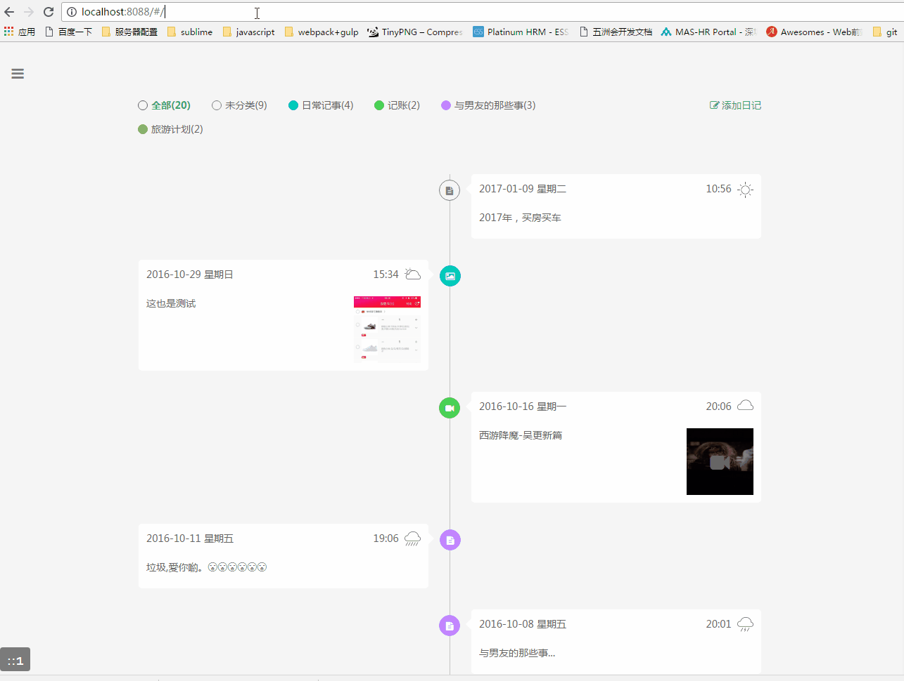
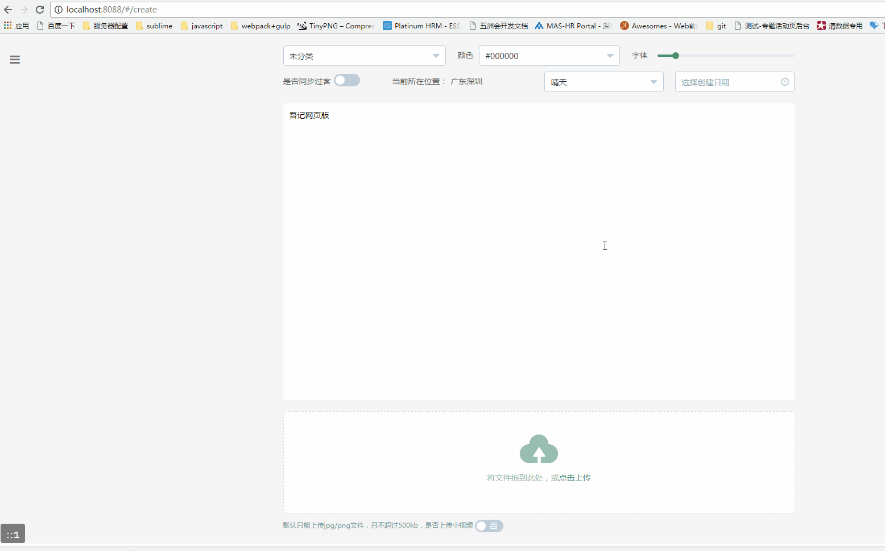
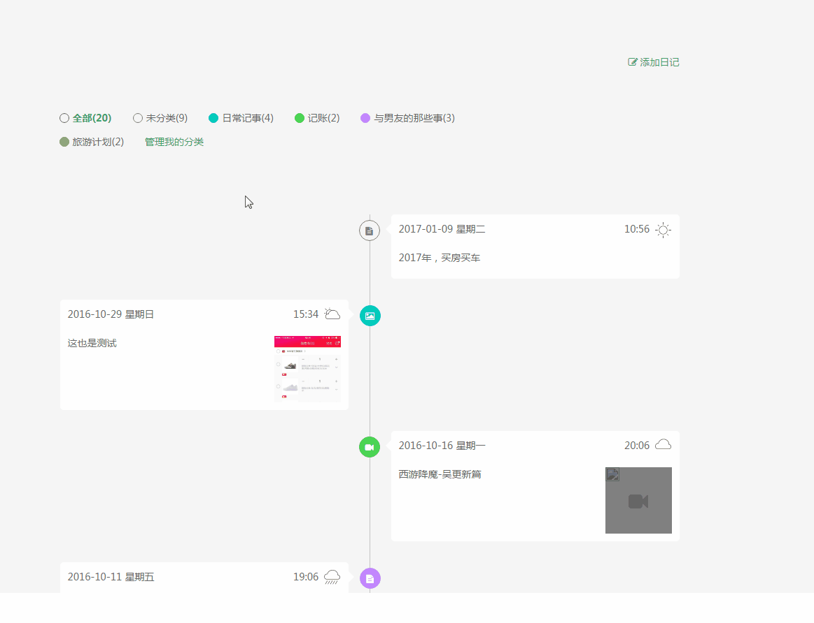

#### 登录注册模块

#### 日记列表

#### 日记创建与编辑

#### 日记详情

#### 我的分类

#### 过客列表


## 吾记前端构建流程

#### 本地环境准备

* 安装node： * https://nodejs.org/en/download/ （"node": ">=6.0"，对应需要升级node-sass，不然使用不了！）
* 配置webpack： npm install -g webpack(sudo权限)
* windows配置cnpm：

```
    npm install -g cnpm --registry=https://registry.npm.taobao.org
    因为npm的默认仓库在国外，下载很慢，国内淘宝搞了个CNPM，每10分钟同步一次，完全够用了
```

### 依赖包安装
* 进入wuji目录
* 执行cnpm install

### 构建
* 开发环境：执行 node server.js（或 npm run serve）
* 热加载 node server.js hot-reload（或 npm run hot）
* mock数据 npm run mock
* 生产环境：执行 npm run build

## 关于source Mapping（仅支持chrome 浏览器）
* source Mapping就是一个代码映射跟踪，方便本地开发时debug压缩文件
* 确保chrome已打开[source Mapping](https://developer.chrome.com/devtools/docs/settings#enable-js source maps) (默认是打开的)
* 打开Develop Tools -》 Sources 即可看到源文件

## hot reload（支持构建的实时刷新）
* 环境准备：
* cnpm install express webpack-dev-middleware webpack-hot-middleware
* 执行node server.js hot-reload（或 npm run hot）
* 静态资源访问eg：http://localhost:8088/Static/dist/js/jobDetail.js

## 自定义主题
* 进入wuji目录
* cnpm install element-theme element-theme-default --save-dev （依赖包安装时已安装）
* 执行node_modules/.bin/et -i
* 生成element-variables.css
* 执行node_modules/.bin/et
* 则会创建./theme
* 更改主题时，对应.babelrc的修改会如下：
```javascript
	{
	  "plugins": [["component", [
	    {
	      "libraryName": "element-ui",
	      "styleLibraryName": "~theme"
	    }
	  ]]]
	}
```

## autoprefixer（样式前缀兼容性处理），在vue-loader option进行配置
* 生成规则：
* 自动加上浏览器样式前缀，兼容各浏览器（针对份额大于全球统计数据的1%，firefox 15）

## 静态资源gulp处理（/public）
```javascript
var gulp = require('gulp'),
    uglify = require('gulp-uglify'), //压缩js
    rename = require("gulp-rename"), //文件重命名
    changed = require('gulp-changed'), //监听文件是否修改
    imagemin = require('gulp-imagemin'), // 图片压缩
    pngquant = require('imagemin-pngquant'), // 深度压缩
    runSequence = require('run-sequence'),     // 同步运行任务插件
    del = require('del'), //删除文件
    spritesmith = require('gulp.spritesmith'), //合成雪碧图
    find = require("gulp-find-glob"); //得到glob对象
```
* 进入wuji/assets/public目录
* cnpm install
* 执行 gulp（压缩js、图片）
* 执行 gulp sprite（生成雪碧图）[将需要合成雪碧的图片放入images/sprite/中某个新建的文件夹，运行，则可以在该文件夹下看到对应sprite.png、sprite.scss]

## 前端页面
> index.html  =>  我的日记列表
> passing.html  =>  过客列表
> account.html => 登录注册页面
